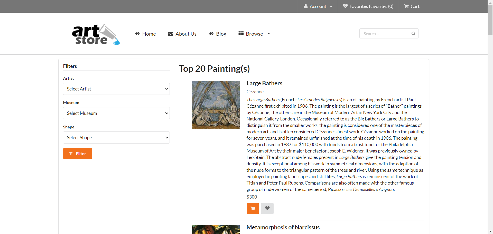
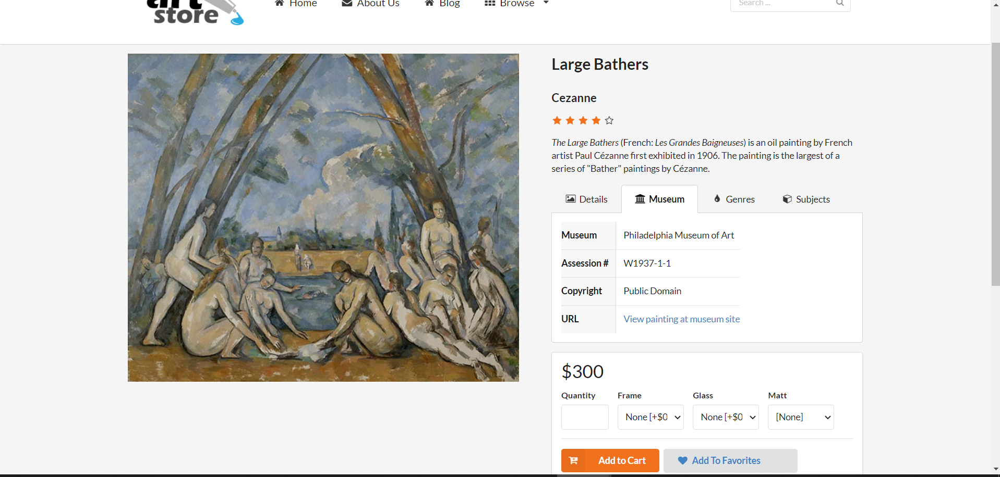
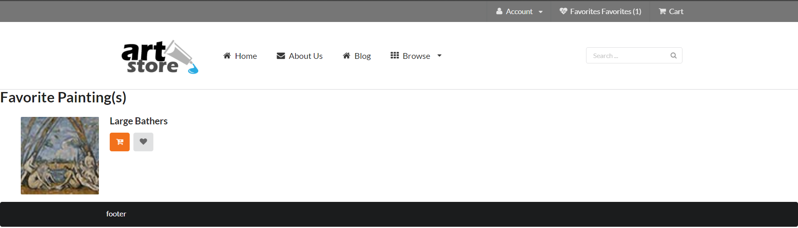

# Art-Store-Website (HTML, CSS, PHP, MySQL, State Management & Caching)


## DESCRIPTION
This project is a simple art store website that is implemented through server side programming with HTML, PHP, CSS, SQL, State Management, and Caching. This website displays several paintings based on the paintings MySQL provided. It is done through heavy PHP object orientated programming and HTML to populate the website with the paintings. There are filter drop downs (only one selected will work for simplicity, if more than one selected nothing happens) to filter out paintings. State Management keeps tabs on favorite paintings, and caching to store used data for efficient loading of the website. 

The website consists of various .php files that gives the website functionality:
- addToFavorites.php
- browse-paintings.php
- remove-favorites.php
- single-paintings.php
- view-favorites.php

While the website is supported by several include files located [here](https://github.com/tony1bally/Art-Store-Website/tree/main/includes), which includes:
- artist-config.inc.php
- constants.inc.php
- database.inc.php
- footer.inc.php
- header.inc.php

## Setting up XAMPP
Running the website requires XAMPP & Memcached, which can be installed in both Windows and MacOS. Once installed, 
1. Run XAMPP
2. Open the explorer by pressing the "Explorer" button located on the right panel of XAMPP
3. Locate using into the ```htdocs```
4. Create folder given a filename and add all contents into that folder
5. Run "Apache" on XAMPP. Keep it running for the next following steps. 

## Setting up SQL through XAMPP
art-small.sql database is needed and is located [here](https://github.com/tony1bally/Art-Store-Website/tree/main/database)
1. Now run "MySQL" in XAMPP.
2. open ```http://localhost/phpmyadmin/``` onto your favorite browser.
3. Select ```import -> choose file``` and select the art-small.sql wherever it is located on your local computer. Then click ```Go``` that is at the bottom of the page and let it import.  

## Setting up the User Authentication in XAMPP
The Art-Store-Website uses a user authentation that can be set up inside XAMPP. With "Apache" and "MySQL" running,
1. open ```http://localhost/phpmyadmin/``` onto your favorite browser.
2. Select ```User Accounts -> Add User Acccount```
3. Apply the following in the respective fields
   - User name: testuser
   - Host name: localhost
   - Password: mypassword
4. Ensure that ```Gloval Privileges``` is applied with ```Check all```
5. Add user by clicking ```Go``` that is at the bottom of the page

## Running the Website
Open your favorite browser, open ```http://localhost/"folder_name"/browse-paintings.php``` and enjoy.


```browse-paintings.php```
* On the left Filters navigation tab, users will be able to filter through a list of Artists, Museums, and Shapes in the drop-downs which are populated from the SQL database provided. When clicking the filter button, the user will be able to view the filtered output list.
* Users will be able to click on the actual painting that is displayed and will direct them to a single-painting.php file based on the Painting ID.
* Users may click the heart icon under each painting as a favourite painting.
* By selecting Favorites on the top-right corner of the page, the user will be directed to the page: view-favorites.php which will list their favorited paintings.

## Viewing of Website

<p align="center">
<h3>General View of Browse-Paintings.php</h3>
Displays the top 20 paintings accordingly along with each respective detail including description, ratings and artist. By Clicking the 'heart' icon, the painting will be added to favorites.

</p>

<p align="center">
<h3>General View of Single-Paintings.php</h3>
Displays the information of the painting incuding the title, artist, overall reviews, details, museum(s), genere(s), subject(s), price, features and related paintings. 
By clicking 'Add to Favourites', the painting will be added to favorites.

</p>

<p align="center">
<h3>General View of viewing favorites when adding or trying to remove favorite paintings</h3>
Displays all painting pictures that are added to favorite. By clicking the 'heart' icon once again, it removes the painting from favorites. 

</p>


## Author

Anthony Massaad 

Copyright @ 2021. All rights reserved.
